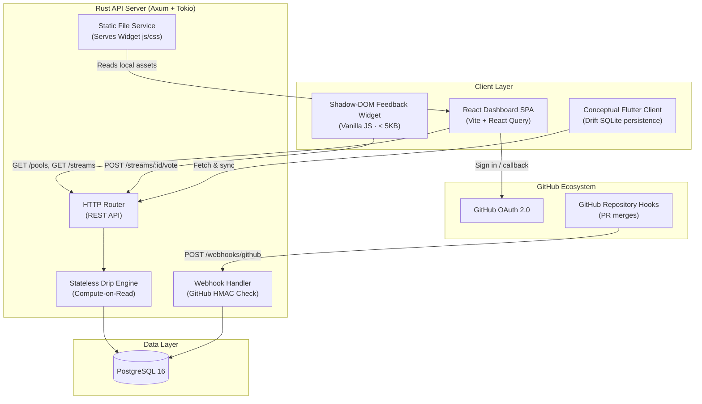

# System Architecture & Data Flows

The DocuDrip protocol is structured as an independently deployable, modular monorepo. It coordinates a financial-grade backend engine, a real-time analytics web dashboard, a lightweight reader-feedback widget, and an offline-first mobile caching framework.

---

## 📐 Unified System Map

This diagram illustrates how data flows between client components, external GitHub hooks, our database layer, and the Axum API server:

---

## ⚡ Core Design Philosophies

To maintain performance, security, and low operational overhead, DocuDrip is built around three core engineering principles:

### 1. Stateless Compute-on-Read Mathematics
Rather than running background worker loops to incrementally update payout records (which incurs synchronization drift, CPU overhead, and write lock queues), DocuDrip uses **stateless compute-on-read**. 
* **The Formula:** Payouts are calculated dynamically at the API boundary:
  $$\text{Dripped Rewards} = \text{Added Characters} \times \text{Base Rate} \times \text{Locale Multiplier} \times \text{Helpfulness Multiplier} \times \frac{\text{Elapsed Time (seconds)}}{86400}$$
* **The Snapshot:** Database writes are reserved solely for **Claim / Withdrawal events** where we record transaction receipts in our immutable ledger.

### 2. Client-Side Decimal Interpolation
Since the API is polled every 5 seconds, standard UI rendering would make balances jump abruptly. DocuDrip solves this using our custom `LiveTicker` component inside the React SPA. 
* It takes the polled backend balance and the calculated flow rate per second.
* A high-performance `requestAnimationFrame` loop continuously increments the fractional display based on precise elapsed microseconds, generating a fluid "dripping" counter while maintaining negligible CPU footprints.

### 3. Encapsulation & Style Shielding
The embeddable feedback widget is injected into third-party documentation platforms. To prevent host-page CSS rules (like global container paddings or button resets) from corrupting the widget layout, the component is fully sealed inside the **Shadow DOM**, ensuring styling integrity across any host environment.
