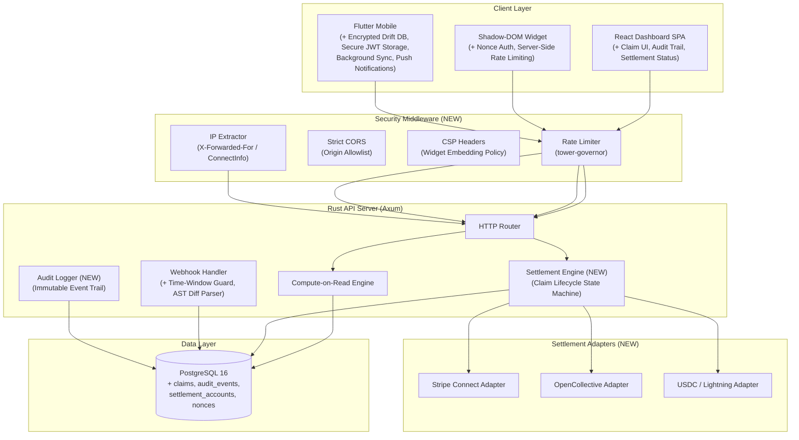

# Phase 1 — Core Protocol Hardening & Settlement Engine

## Detailed Execution Plan & Architectural Blueprint

> **Timeline:** Q3 2026 (8 weeks)
> **Scope:** Security hardening, financial settlement infrastructure, anti-sybil protections, and production readiness across all four subsystems.

---

## Table of Contents

1. [Current State Audit](#1-current-state-audit)
2. [Phase 1 Architecture Overview](#2-phase-1-architecture-overview)
3. [Work Stream A — Webhook & Ingestion Hardening](#3-work-stream-a--webhook--ingestion-hardening)
4. [Work Stream B — Settlement Engine & Claim Lifecycle](#4-work-stream-b--settlement-engine--claim-lifecycle)
5. [Work Stream C — Anti-Sybil & Vote Integrity](#5-work-stream-c--anti-sybil--vote-integrity)
6. [Work Stream D — Frontend Claim & Audit UI](#6-work-stream-d--frontend-claim--audit-ui)
7. [Work Stream E — Mobile Security & Offline Sync](#7-work-stream-e--mobile-security--offline-sync)
8. [Work Stream F — Production Infrastructure](#8-work-stream-f--production-infrastructure)
9. [Database Migration Plan](#9-database-migration-plan)
10. [API Contract Changes](#10-api-contract-changes)
11. [Dependency Graph & Sprint Plan](#11-dependency-graph--sprint-plan)
12. [Testing & Quality Gates](#12-testing--quality-gates)
13. [Risk Register](#13-risk-register)

---

## 1. Current State Audit

### What Exists Today

| System | Status | Key Gaps |
|:---|:---|:---|
| **Backend (Rust/Axum)** | Functional API with 7 tables, compute-on-read engine, GitHub OAuth, HMAC webhook verification, JWT auth with role extractors (`AuthUser`, `SponsorUser`) | CORS is `permissive()`, voter IP comes from JSON body (spoofable), no rate limiting, no claim/withdrawal endpoints, settlement logic absent, webhook replay window unlimited |
| **Frontend (React 19)** | Dashboard with pools table, `LiveTicker` interpolation, stream cards, sandbox simulator, GitHub OAuth flow | No claim UI, no transaction history, no audit trail view, no settlement status indicators, no admin controls for sponsors |
| **Widget (Vanilla JS)** | Shadow DOM Web Component, `localStorage` vote deduplication, hardcoded `localhost` URLs | No server-side rate limiting, `localStorage` trivially clearable, no nonce verification, no CSP headers, URL not configurable at runtime |
| **Mobile (Flutter/Drift)** | Schema-only (`PoolsTable`, `StreamsTable`), reactive watches, offline vote simulation | No `main.dart`, no network layer, no UI, no secure storage, no background sync, no Drift code generation run, missing `database.g.dart` |

---

## 2. Phase 1 Architecture Overview

---

## 3. Work Stream Highlights

- **Work Stream A (Ingestion):** Time-bounded replay protection (5-min window), AST-aware diff parser ignoring TOC/whitespace/lockfiles, PR author verification.
- **Work Stream B (Settlement):** Full claim lifecycle state machine, multi-provider settlement adapters (Stripe, OpenCollective, Crypto), 4 new PostgreSQL tables (`claims`, `settlement_accounts`, `audit_events`, `widget_nonces`).
- **Work Stream C (Anti-Sybil):** Server-side IP extraction, browser fingerprinting, widget nonces, 30-day exponential vote time-decay.
- **Work Stream D (Frontend):** Claim submission UI, settlement account management, audit trail log.
- **Work Stream E (Mobile):** Encrypted Drift SQLite DB (`SQLCipher`), secure JWT storage, background sync service with offline action queue.
- **Work Stream F (Infrastructure):** CORS allowlists, CSP headers, dynamic widget URL resolution, structured audit logging.
