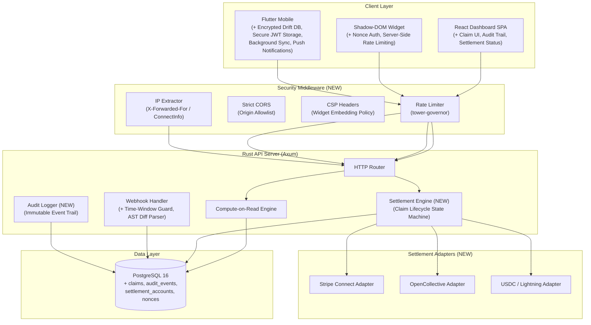
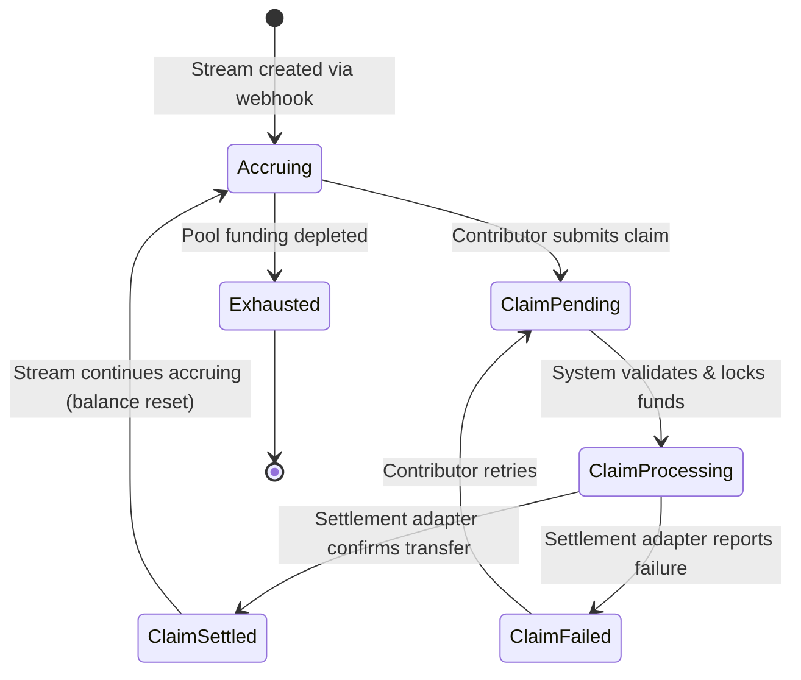
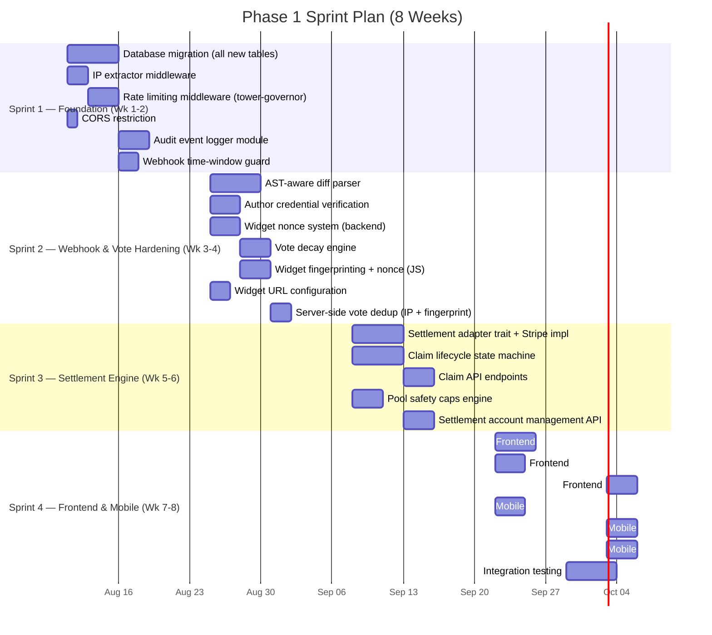
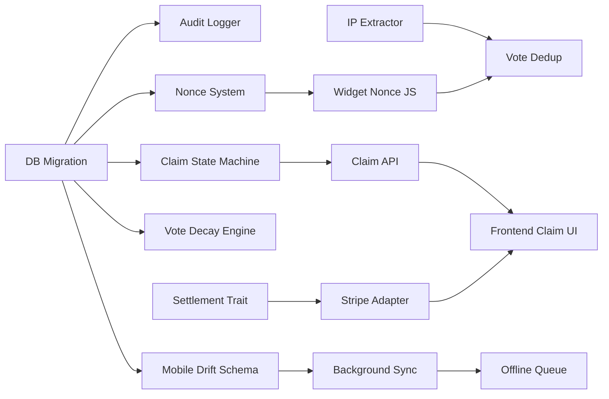

# Phase 1 — Core Protocol Hardening & Settlement Engine

## Detailed Execution Plan & Architectural Blueprint

> **Timeline:** Q3 2026 (8 weeks)
> **Scope:** Security hardening, financial settlement infrastructure, anti-sybil protections, and production readiness across all four subsystems.

---

## Table of Contents

1. [Current State Audit](#1-current-state-audit)
2. [Phase 1 Architecture Overview](#2-phase-1-architecture-overview)
3. [Work Stream A — Webhook & Ingestion Hardening](#3-work-stream-a--webhook--ingestion-hardening)
4. [Work Stream B — Settlement Engine & Claim Lifecycle](#4-work-stream-b--settlement-engine--claim-lifecycle)
5. [Work Stream C — Anti-Sybil & Vote Integrity](#5-work-stream-c--anti-sybil--vote-integrity)
6. [Work Stream D — Frontend Claim & Audit UI](#6-work-stream-d--frontend-claim--audit-ui)
7. [Work Stream E — Mobile Security & Offline Sync](#7-work-stream-e--mobile-security--offline-sync)
8. [Work Stream F — Production Infrastructure](#8-work-stream-f--production-infrastructure)
9. [Database Migration Plan](#9-database-migration-plan)
10. [API Contract Changes](#10-api-contract-changes)
11. [Dependency Graph & Sprint Plan](#11-dependency-graph--sprint-plan)
12. [Testing & Quality Gates](#12-testing--quality-gates)
13. [Risk Register](#13-risk-register)

---

## 1. Current State Audit

### What Exists Today

| System | Status | Key Gaps |
|:---|:---|:---|
| **Backend (Rust/Axum)** | Functional API with 7 tables, compute-on-read engine, GitHub OAuth, HMAC webhook verification, JWT auth with role extractors (`AuthUser`, `SponsorUser`) | CORS is `permissive()`, voter IP comes from JSON body (spoofable), no rate limiting, no claim/withdrawal endpoints, settlement logic absent, webhook replay window unlimited |
| **Frontend (React 19)** | Dashboard with pools table, `LiveTicker` interpolation, stream cards, sandbox simulator, GitHub OAuth flow | No claim UI, no transaction history, no audit trail view, no settlement status indicators, no admin controls for sponsors |
| **Widget (Vanilla JS)** | Shadow DOM Web Component, `localStorage` vote deduplication, hardcoded `localhost` URLs | No server-side rate limiting, `localStorage` trivially clearable, no nonce verification, no CSP headers, URL not configurable at runtime |
| **Mobile (Flutter/Drift)** | Schema-only (`PoolsTable`, `StreamsTable`), reactive watches, offline vote simulation | No `main.dart`, no network layer, no UI, no secure storage, no background sync, no Drift code generation run, missing `database.g.dart` |

### Critical Security Findings

1. **Vote Spoofing:** `POST /streams/:id/vote` accepts `voter_ip` from the JSON request body. Any client can fabricate IPs to bypass duplicate checks.
2. **Unlimited CORS:** `CorsLayer::permissive()` in production allows any origin to make authenticated requests.
3. **No Rate Limiting:** Zero request throttling on any endpoint, including anonymous vote submission.
4. **Widget URL Hardcoding:** `widget.js` hardcodes `http://localhost:8080` — cannot deploy to production without rebuild.
5. **JWT Never Rotates:** Tokens have a static expiry (`JWT_EXPIRY_HOURS`), no refresh mechanism, no revocation list.
6. **Webhook Replay Window:** Delivery IDs are checked for uniqueness but old webhook events are never pruned — no time-based expiry guard.
7. **Mobile Unencrypted:** SQLite database stores financial data in plaintext on device filesystem.

---

## 2. Phase 1 Architecture Overview



---

## 3. Work Stream A — Webhook & Ingestion Hardening

### A1. Time-Bounded Webhook Replay Protection

**Problem:** Current implementation checks `delivery_id` uniqueness but accepts arbitrarily old replayed webhooks.

**Solution:** Add a timestamp validation window.

```rust
// backend/src/routes/webhooks.rs — NEW validation
const WEBHOOK_MAX_AGE_SECONDS: i64 = 300; // 5-minute window

fn validate_webhook_timestamp(headers: &HeaderMap) -> Result<(), AppError> {
    // GitHub sends X-GitHub-Hook-Installation-Target-ID and timestamp
    // We validate the signature was generated within the last 5 minutes
    let delivery_timestamp = headers
        .get("X-GitHub-Hook-Timestamp")
        .and_then(|v| v.to_str().ok())
        .and_then(|s| s.parse::<i64>().ok())
        .unwrap_or_else(|| Utc::now().timestamp());

    let age = Utc::now().timestamp() - delivery_timestamp;
    if age > WEBHOOK_MAX_AGE_SECONDS || age < -60 {
        return Err(AppError::BadRequest(
            "Webhook timestamp outside acceptable window".into()
        ));
    }
    Ok(())
}
```

**Migration:** Add `expires_at` column to `webhook_events` and a scheduled cleanup query.

```sql
ALTER TABLE webhook_events ADD COLUMN expires_at TIMESTAMPTZ DEFAULT NOW() + INTERVAL '24 hours';
CREATE INDEX idx_webhook_events_expires ON webhook_events(expires_at);
```

### A2. AST-Aware Markdown Diff Parser

**Problem:** Current character counting uses raw `additions` from the GitHub API, which includes formatting whitespace, auto-generated TOCs, and lockfile noise.

**Solution:** Implement a Markdown-aware diff analyzer in the webhook handler.

```rust
// backend/src/engine/diff_parser.rs (NEW MODULE)

/// Parses a raw unified diff and returns only meaningful documentation character changes.
pub struct DiffAnalysis {
    pub meaningful_additions: i32,
    pub meaningful_deletions: i32,
    pub is_formatting_only: bool,
    pub detected_patterns: Vec<DiffPattern>,
}

pub enum DiffPattern {
    TableOfContents,       // Auto-generated TOC markers
    WhitespaceOnly,        // Indentation / trailing space changes
    FrontmatterOnly,       // YAML frontmatter metadata changes
    CodeBlockReformat,     // Language tag changes without content change
    MeaningfulContent,     // Actual prose / code documentation
}

/// Filters to apply against raw diff hunks.
pub fn analyze_diff(raw_diff: &str) -> DiffAnalysis {
    // 1. Parse unified diff format into hunks
    // 2. For each added line:
    //    - Skip lines matching TOC patterns (<!-- TOC -->, ## Table of Contents auto-gen)
    //    - Skip pure whitespace additions
    //    - Skip frontmatter-only changes (lines between --- markers)
    //    - Count remaining characters as meaningful additions
    // 3. Flag as formatting_only if meaningful_additions == 0
    todo!()
}
```

**File Extension Allowlist Enhancement:**

```rust
// Extend is_doc_file() with stricter validation
const DOC_EXTENSIONS: &[&str] = &[".md", ".mdx", ".rst", ".adoc", ".txt"];
const EXCLUDED_FILES: &[&str] = &[
    "CHANGELOG.md", "CONTRIBUTING.md", "LICENSE.md",
    "CODE_OF_CONDUCT.md", "SECURITY.md", "CODEOWNERS",
    "package-lock.json", "Cargo.lock", "yarn.lock",
];
const EXCLUDED_DIRS: &[&str] = &[
    ".github/", "node_modules/", "target/", ".git/",
    "vendor/", "dist/", "build/",
];
```

### A3. Author Credential Verification

**Problem:** Webhook payload contains `sender.login` but this isn't verified against the actual PR author stored in the database.

**Solution:** Cross-reference the PR author via GitHub API before crediting.

```rust
// backend/src/routes/webhooks.rs — Enhanced author verification
async fn verify_pr_author(
    github: &GitHubClient,
    token: &str,
    repo: &str,
    pr_number: i32,
    claimed_author: &str,
) -> Result<GitHubUser, AppError> {
    let pr_details = github.fetch_pr_details(repo, pr_number, token).await?;

    // Verify the merge author matches the claimed sender
    if pr_details.user.login != claimed_author {
        return Err(AppError::BadRequest(format!(
            "Author mismatch: webhook claims '{}' but PR #{} was authored by '{}'",
            claimed_author, pr_number, pr_details.user.login
        )));
    }

    // Verify the PR was actually merged (not just closed)
    if !pr_details.merged {
        return Err(AppError::BadRequest("PR was closed without merging".into()));
    }

    Ok(pr_details.user)
}
```

**New GitHub Service Method:**

```rust
// backend/src/services/github.rs — NEW
pub async fn fetch_pr_details(
    &self, repo: &str, pr_number: i32, token: &str
) -> Result<PullRequestDetails, AppError> {
    let url = format!("https://api.github.com/repos/{}/pulls/{}", repo, pr_number);
    let resp = self.client
        .get(&url)
        .header("Authorization", format!("Bearer {}", token))
        .header("User-Agent", "DocuDrip-Server")
        .send().await?;
    Ok(resp.json().await?)
}
```

---

## 4. Work Stream B — Settlement Engine & Claim Lifecycle

### B1. Claim State Machine

Contributors must be able to claim accumulated rewards through a structured lifecycle:



**Claim Business Rules:**
- Minimum claim threshold: **$1.00 USDC** (prevents dust claims that cost more in fees).
- Maximum claim frequency: **1 claim per stream per 24 hours** (prevents settlement spam).
- Pool balance guard: Claim amount cannot exceed `pool.funding_amount - pool.total_dripped`.
- Concurrent claim lock: Only one pending claim per stream at a time (database advisory lock).

### B2. New Database Tables

```sql
-- Settlement accounts linking contributors to payout destinations
CREATE TABLE settlement_accounts (
    id              UUID PRIMARY KEY DEFAULT gen_random_uuid(),
    user_id         UUID NOT NULL REFERENCES users(id),
    provider        TEXT NOT NULL,  -- 'stripe', 'opencollective', 'usdc_base', 'lightning'
    provider_ref    TEXT NOT NULL,  -- Stripe account ID, wallet address, etc.
    is_verified     BOOLEAN NOT NULL DEFAULT false,
    is_default      BOOLEAN NOT NULL DEFAULT false,
    created_at      TIMESTAMPTZ NOT NULL DEFAULT NOW(),
    updated_at      TIMESTAMPTZ NOT NULL DEFAULT NOW(),
    UNIQUE(user_id, provider, provider_ref)
);

-- Claim records with full lifecycle tracking
CREATE TABLE claims (
    id              UUID PRIMARY KEY DEFAULT gen_random_uuid(),
    stream_id       UUID NOT NULL REFERENCES streams(id),
    user_id         UUID NOT NULL REFERENCES users(id),
    amount          DECIMAL(18, 8) NOT NULL,
    status          TEXT NOT NULL DEFAULT 'pending',
        -- pending | processing | settled | failed | cancelled
    settlement_id   UUID REFERENCES settlement_accounts(id),
    provider_tx_ref TEXT,           -- External transaction reference (Stripe PI, tx hash, etc.)
    failure_reason  TEXT,
    claimed_at      TIMESTAMPTZ NOT NULL DEFAULT NOW(),
    settled_at      TIMESTAMPTZ,
    CHECK (amount > 0),
    CHECK (status IN ('pending', 'processing', 'settled', 'failed', 'cancelled'))
);

CREATE INDEX idx_claims_stream ON claims(stream_id);
CREATE INDEX idx_claims_user ON claims(user_id);
CREATE INDEX idx_claims_status ON claims(status);

-- Immutable audit event log (append-only)
CREATE TABLE audit_events (
    id              UUID PRIMARY KEY DEFAULT gen_random_uuid(),
    event_type      TEXT NOT NULL,
        -- 'claim.created', 'claim.processing', 'claim.settled', 'claim.failed',
        -- 'pool.created', 'pool.suspended', 'vote.recorded', 'vote.rejected',
        -- 'webhook.received', 'webhook.rejected', 'auth.login', 'auth.logout'
    actor_id        UUID,           -- User who triggered the event (NULL for system events)
    resource_type   TEXT NOT NULL,   -- 'claim', 'stream', 'pool', 'vote', 'webhook'
    resource_id     UUID NOT NULL,
    metadata        JSONB NOT NULL DEFAULT '{}',
    ip_address      TEXT,
    created_at      TIMESTAMPTZ NOT NULL DEFAULT NOW()
);

CREATE INDEX idx_audit_resource ON audit_events(resource_type, resource_id);
CREATE INDEX idx_audit_actor ON audit_events(actor_id);
CREATE INDEX idx_audit_type ON audit_events(event_type);
CREATE INDEX idx_audit_created ON audit_events(created_at);
```

### B3. Settlement Adapter Trait

```rust
// backend/src/settlement/mod.rs (NEW MODULE)

use async_trait::async_trait;
use rust_decimal::Decimal;
use uuid::Uuid;

pub mod stripe_adapter;
pub mod opencollective_adapter;
pub mod crypto_adapter;

#[derive(Debug, Clone)]
pub struct SettlementRequest {
    pub claim_id: Uuid,
    pub recipient_ref: String,    // Provider-specific destination
    pub amount: Decimal,
    pub currency: String,         // "USD", "USDC"
    pub idempotency_key: String,  // claim_id as string for retry safety
}

#[derive(Debug, Clone)]
pub struct SettlementResult {
    pub provider_tx_ref: String,
    pub settled_amount: Decimal,
    pub fee_amount: Decimal,
}

#[derive(Debug)]
pub enum SettlementError {
    InsufficientFunds,
    InvalidRecipient,
    ProviderUnavailable(String),
    NetworkError(String),
    RateLimited,
}

#[async_trait]
pub trait SettlementAdapter: Send + Sync {
    /// Human-readable provider name
    fn provider_name(&self) -> &str;

    /// Execute a settlement transfer
    async fn execute(
        &self,
        request: SettlementRequest,
    ) -> Result<SettlementResult, SettlementError>;

    /// Check if a previous settlement completed (for retry/polling)
    async fn check_status(
        &self,
        provider_tx_ref: &str,
    ) -> Result<SettlementStatus, SettlementError>;
}

#[derive(Debug, Clone, PartialEq)]
pub enum SettlementStatus {
    Pending,
    Completed,
    Failed(String),
}
```

### B4. Claim API Endpoints

| Method | Endpoint | Auth | Purpose |
|:---|:---|:---|:---|
| `POST` | `/api/v1/claims` | `AuthUser` | Submit a new reward claim for a stream |
| `GET` | `/api/v1/claims` | `AuthUser` | List all claims for the authenticated user |
| `GET` | `/api/v1/claims/:id` | `AuthUser` | Get claim details and settlement status |
| `POST` | `/api/v1/claims/:id/cancel` | `AuthUser` | Cancel a pending claim |
| `POST` | `/api/v1/settlement-accounts` | `AuthUser` | Register a payout destination |
| `GET` | `/api/v1/settlement-accounts` | `AuthUser` | List registered payout destinations |
| `DELETE` | `/api/v1/settlement-accounts/:id` | `AuthUser` | Remove a payout destination |
| `GET` | `/api/v1/audit` | `AuthUser` | Query audit trail for own resources |
| `GET` | `/api/v1/pools/:id/audit` | `SponsorUser` | Query audit trail for a pool (sponsor only) |

### B5. Pool Safety Caps

```rust
// backend/src/engine/safety.rs (NEW MODULE)

use rust_decimal::Decimal;
use rust_decimal_macros::dec;

pub struct PoolSafetyConfig {
    /// Maximum single claim amount (prevents draining entire pool)
    pub max_claim_amount: Decimal,
    /// Maximum claims per contributor per 24h period
    pub max_claims_per_day: u32,
    /// Minimum pool balance reserve (pool suspends below this)
    pub min_pool_reserve: Decimal,
    /// Maximum percentage of pool claimable in single transaction
    pub max_claim_percentage: Decimal,
}

impl Default for PoolSafetyConfig {
    fn default() -> Self {
        Self {
            max_claim_amount: dec!(10000.00),
            max_claims_per_day: 3,
            min_pool_reserve: dec!(10.00),
            max_claim_percentage: dec!(0.25), // 25% of remaining pool balance
        }
    }
}

pub fn validate_claim(
    claim_amount: Decimal,
    pool_remaining: Decimal,
    claims_today: u32,
    config: &PoolSafetyConfig,
) -> Result<(), ClaimValidationError> {
    if claim_amount > config.max_claim_amount {
        return Err(ClaimValidationError::ExceedsMaxAmount);
    }
    if claim_amount > pool_remaining * config.max_claim_percentage {
        return Err(ClaimValidationError::ExceedsPoolPercentage);
    }
    if pool_remaining - claim_amount < config.min_pool_reserve {
        return Err(ClaimValidationError::InsufficientPoolReserve);
    }
    if claims_today >= config.max_claims_per_day {
        return Err(ClaimValidationError::DailyLimitReached);
    }
    Ok(())
}
```

---

## 5. Work Stream C — Anti-Sybil & Vote Integrity

### C1. Server-Side IP Extraction

**Problem:** Vote endpoint reads `voter_ip` from JSON body — trivially spoofable.

**Solution:** Extract real client IP from connection metadata and proxy headers.

```rust
// backend/src/middleware/ip_extractor.rs (NEW)

use axum::extract::ConnectInfo;
use std::net::SocketAddr;

/// Extracts the real client IP, respecting reverse proxy headers.
/// Priority: X-Forwarded-For > X-Real-IP > ConnectInfo
pub fn extract_client_ip(
    headers: &HeaderMap,
    connect_info: Option<&ConnectInfo<SocketAddr>>,
) -> String {
    // 1. Check X-Forwarded-For (first IP in chain is the client)
    if let Some(forwarded) = headers.get("X-Forwarded-For") {
        if let Ok(value) = forwarded.to_str() {
            if let Some(first_ip) = value.split(',').next() {
                return first_ip.trim().to_string();
            }
        }
    }

    // 2. Check X-Real-IP
    if let Some(real_ip) = headers.get("X-Real-IP") {
        if let Ok(value) = real_ip.to_str() {
            return value.trim().to_string();
        }
    }

    // 3. Fall back to socket address
    connect_info
        .map(|ci| ci.0.ip().to_string())
        .unwrap_or_else(|| "unknown".to_string())
}
```

**Vote endpoint changes:** Remove `voter_ip` from request body entirely. Extract from connection.

### C2. Multi-Layer Vote Deduplication

```sql
-- Extend votes table with fingerprint and decay columns
ALTER TABLE votes ADD COLUMN fingerprint_hash TEXT;
ALTER TABLE votes ADD COLUMN user_agent TEXT;
ALTER TABLE votes ADD COLUMN decay_weight DECIMAL(4, 3) NOT NULL DEFAULT 1.000;

-- Compound unique constraint: one vote per IP+fingerprint per stream
CREATE UNIQUE INDEX idx_votes_dedup
    ON votes(stream_id, voter_ip, fingerprint_hash);
```

**Fingerprint Strategy (Widget Side):**

```javascript
// widget/src/fingerprint.js (NEW)
// Lightweight browser fingerprint — NOT for tracking, only anti-sybil dedup

export function generateFingerprint() {
    const components = [
        navigator.language,
        screen.width + 'x' + screen.height,
        screen.colorDepth,
        new Date().getTimezoneOffset(),
        navigator.hardwareConcurrency || 'unknown',
        // Canvas fingerprint (fast, low-entropy)
        (() => {
            try {
                const canvas = document.createElement('canvas');
                const ctx = canvas.getContext('2d');
                ctx.textBaseline = 'top';
                ctx.font = '14px Arial';
                ctx.fillText('DocuDrip', 2, 2);
                return canvas.toDataURL().slice(-32);
            } catch { return 'no-canvas'; }
        })(),
    ];

    // Simple hash (non-cryptographic, privacy-preserving)
    const raw = components.join('|');
    let hash = 0;
    for (let i = 0; i < raw.length; i++) {
        hash = ((hash << 5) - hash + raw.charCodeAt(i)) | 0;
    }
    return Math.abs(hash).toString(36);
}
```

### C3. Rate Limiting

```rust
// backend/src/middleware/rate_limit.rs (NEW)
// Using tower-governor for token-bucket rate limiting

// Rate limit tiers:
//   Anonymous vote endpoints:  10 requests / minute / IP
//   Authenticated read:        60 requests / minute / user
//   Authenticated write:       20 requests / minute / user
//   Webhook ingestion:         30 requests / minute / IP
```

**New Cargo dependency:**

```toml
[dependencies]
tower_governor = "0.4"
```

### C4. Weighted Rating Decay

**Problem:** Old votes carry the same weight as recent votes, even if documentation has been substantially rewritten.

**Solution:** Exponential time-decay on helpfulness votes.

```rust
// backend/src/engine/vote_decay.rs (NEW)

use chrono::{DateTime, Utc};

const HALF_LIFE_DAYS: f64 = 30.0; // Vote weight halves every 30 days

/// Calculate the decayed weight of a vote based on its age.
pub fn decay_weight(vote_created: DateTime<Utc>, now: DateTime<Utc>) -> f64 {
    let age_days = (now - vote_created).num_seconds() as f64 / 86400.0;
    let lambda = (2.0_f64.ln()) / HALF_LIFE_DAYS;
    (-lambda * age_days).exp()
}

/// Calculate weighted approval ratio across all votes for a stream.
pub fn weighted_approval_ratio(votes: &[(bool, DateTime<Utc>)]) -> f64 {
    let now = Utc::now();
    let mut weighted_up = 0.0;
    let mut weighted_total = 0.0;

    for (is_upvote, created_at) in votes {
        let weight = decay_weight(*created_at, now);
        weighted_total += weight;
        if *is_upvote {
            weighted_up += weight;
        }
    }

    if weighted_total == 0.0 { 1.0 } else { weighted_up / weighted_total }
}
```

### C5. Widget Nonce Authentication

**Problem:** Anyone can spam the vote endpoint without proving they viewed the documentation page.

**Solution:** Server-issued nonces that the widget must present when voting.

```
Sequence:
1. Widget loads → GET /api/v1/widget/nonce?stream_id=X
2. Server generates a short-lived nonce (HMAC of stream_id + timestamp + random), stores in DB
3. Widget receives nonce, includes it in vote POST body
4. Server validates nonce exists, hasn't expired (5 min TTL), and hasn't been used
5. Server marks nonce as consumed after successful vote
```

```sql
CREATE TABLE widget_nonces (
    id          UUID PRIMARY KEY DEFAULT gen_random_uuid(),
    stream_id   UUID NOT NULL REFERENCES streams(id),
    nonce       TEXT NOT NULL UNIQUE,
    expires_at  TIMESTAMPTZ NOT NULL,
    consumed    BOOLEAN NOT NULL DEFAULT false,
    created_at  TIMESTAMPTZ NOT NULL DEFAULT NOW()
);

CREATE INDEX idx_nonces_stream ON widget_nonces(stream_id);
CREATE INDEX idx_nonces_expiry ON widget_nonces(expires_at);
```

---

## 6. Work Stream D — Frontend Claim & Audit UI

### D1. New Pages & Components

| Component | Path | Purpose |
|:---|:---|:---|
| `ClaimPage.jsx` | `/claims` | Contributor view: list own claims, submit new claims, track settlement status |
| `SettlementSetup.jsx` | `/settings/settlement` | Register and manage payout destinations (Stripe, wallet, etc.) |
| `AuditTrail.jsx` | `/audit` | Chronological event log for own streams, claims, and votes |
| `PoolAudit.jsx` | `/pools/:id/audit` | Sponsor view: audit trail for a specific funding pool |
| `ClaimCard.jsx` | (component) | Individual claim status card with lifecycle indicator |
| `SettlementBadge.jsx` | (component) | Visual badge showing settlement provider and status |

### D2. New Zustand Store

```javascript
// frontend/src/stores/claimStore.js (NEW)
import { create } from 'zustand';

export const useClaimStore = create((set) => ({
    selectedStreamId: null,
    setSelectedStreamId: (id) => set({ selectedStreamId: id }),
    claimAmount: 0,
    setClaimAmount: (amount) => set({ claimAmount: amount }),
    activeFilter: 'all', // all | pending | settled | failed
    setActiveFilter: (filter) => set({ activeFilter: filter }),
}));
```

### D3. Navigation Update

Add new tabs to `DashboardShell` in `App.jsx`:

```javascript
// New nav buttons
<button className={`nav-btn ${activeTab === 'claims' ? 'active' : ''}`}>
    <Wallet size={18} /> Claims & Payouts
</button>
<button className={`nav-btn ${activeTab === 'audit' ? 'active' : ''}`}>
    <ScrollText size={18} /> Audit Trail
</button>
```

### D4. Claim Submission Flow (UI Wireframe)

```
┌──────────────────────────────────────────────────────────┐
│  💰 Claim Rewards                                        │
│                                                          │
│  Select Stream:  [@techWriter99 — docs/guide.md    ▼]   │
│                                                          │
│  ┌────────────────────────────────────────────────────┐  │
│  │  Accrued Balance         $142.837291 USDC          │  │
│  │  Claim Amount            [$100.00         ]        │  │
│  │  Settlement Destination  [Stripe — ****4242  ▼]    │  │
│  │                                                    │  │
│  │  Pool Remaining          $4,857.16 USDC            │  │
│  │  Daily Claims Used       1 / 3                     │  │
│  │  Est. Settlement Fee     ~$0.30                    │  │
│  │                                                    │  │
│  │  [ Submit Claim → ]                                │  │
│  └────────────────────────────────────────────────────┘  │
│                                                          │
│  Recent Claims:                                          │
│  ┌──────────┬──────────┬──────────┬──────────────────┐  │
│  │ Amount   │ Status   │ Provider │ Date             │  │
│  ├──────────┼──────────┼──────────┼──────────────────┤  │
│  │ $50.00   │ ● Settled│ Stripe   │ 2026-08-08 14:22 │  │
│  │ $25.00   │ ○ Pending│ USDC     │ 2026-08-10 09:15 │  │
│  └──────────┴──────────┴──────────┴──────────────────┘  │
└──────────────────────────────────────────────────────────┘
```

---

## 7. Work Stream E — Mobile Security & Offline Sync

### E1. Drift Schema Expansion

New tables for claims, settlement accounts, and an offline action queue:

```dart
// mobile/lib/db/database.dart — NEW TABLES

/// Cached claim records synced from the backend
class ClaimsTable extends Table {
  TextColumn get id => text()();
  TextColumn get streamId => text()();
  TextColumn get userId => text()();
  RealColumn get amount => real()();
  TextColumn get status => text()();  // pending, processing, settled, failed
  TextColumn get providerTxRef => text().nullable()();
  TextColumn get failureReason => text().nullable()();
  DateTimeColumn get claimedAt => dateTime()();
  DateTimeColumn get settledAt => dateTime().nullable()();

  @override
  Set<Column> get primaryKey => {id};
}

/// Offline action queue for operations performed without connectivity
class OfflineActionsTable extends Table {
  IntColumn get id => integer().autoIncrement()();
  TextColumn get actionType => text()();  // 'vote', 'claim_submit'
  TextColumn get payload => text()();     // JSON-encoded action data
  TextColumn get status => text().withDefault(const Constant('pending'))();
  IntColumn get retryCount => integer().withDefault(const Constant(0))();
  DateTimeColumn get createdAt => dateTime()();
  DateTimeColumn get lastAttemptAt => dateTime().nullable()();
}

/// JWT session tokens stored securely
class SessionTable extends Table {
  IntColumn get id => integer().withDefault(const Constant(1))();
  TextColumn get jwtToken => text()();
  TextColumn get username => text()();
  TextColumn get role => text()();
  DateTimeColumn get expiresAt => dateTime()();

  @override
  Set<Column> get primaryKey => {id};
}
```

**Updated database annotation:**

```dart
@DriftDatabase(tables: [
  PoolsTable,
  StreamsTable,
  ClaimsTable,
  OfflineActionsTable,
  SessionTable,
])
class AppDatabase extends _$AppDatabase {
  // schemaVersion bumped to 2
  @override
  int get schemaVersion => 2;

  @override
  MigrationStrategy get migration => MigrationStrategy(
    onCreate: (Migrator m) => m.createAll(),
    onUpgrade: (Migrator m, int from, int to) async {
      if (from < 2) {
        await m.createTable(claimsTable);
        await m.createTable(offlineActionsTable);
        await m.createTable(sessionTable);
      }
    },
  );
}
```

### E2. Encrypted Database

**New dependency:**

```yaml
# mobile/pubspec.yaml — replace sqlite3_flutter_libs with encrypted variant
dependencies:
  drift: ^2.20.0
  drift_sqflite: ^2.0.0             # For SQLCipher support
  sqflite_common_ffi: ^2.3.0
  flutter_secure_storage: ^9.0.0    # Secure key storage
  path_provider: ^2.1.1
  path: ^1.8.3
```

**Encrypted connection:**

```dart
// mobile/lib/db/database.dart — Updated _openConnection
import 'package:flutter_secure_storage/flutter_secure_storage.dart';

LazyDatabase _openConnection() {
  return LazyDatabase(() async {
    final storage = const FlutterSecureStorage();

    // Generate or retrieve encryption key
    String? key = await storage.read(key: 'docudrip_db_key');
    if (key == null) {
      key = _generateSecureKey();
      await storage.write(key: 'docudrip_db_key', value: key);
    }

    final dbFolder = await getApplicationDocumentsDirectory();
    final file = File(p.join(dbFolder.path, 'docudrip_encrypted.db'));
    return NativeDatabase.createInBackground(file, setup: (db) {
      db.execute("PRAGMA key = '$key'");
    });
  });
}
```

### E3. Background Sync Service

```dart
// mobile/lib/services/sync_service.dart (NEW)

/// Periodic background sync that:
/// 1. Fetches latest pools, streams, and claims from backend API
/// 2. Batch upserts into local Drift tables
/// 3. Processes offline action queue (votes, claim submissions)
/// 4. Retries failed offline actions with exponential backoff
class SyncService {
  final AppDatabase db;
  final ApiClient api;

  Future<void> syncAll() async {
    await _syncPools();
    await _syncStreams();
    await _syncClaims();
    await _processOfflineQueue();
  }

  Future<void> _processOfflineQueue() async {
    final pending = await db.getPendingOfflineActions();
    for (final action in pending) {
      try {
        await _executeOfflineAction(action);
        await db.markOfflineActionComplete(action.id);
      } catch (e) {
        await db.incrementRetryCount(action.id);
        if (action.retryCount >= 5) {
          await db.markOfflineActionFailed(action.id);
        }
      }
    }
  }
}
```

### E4. New Mobile Dependencies

```yaml
# mobile/pubspec.yaml — Additional Phase 1 dependencies
dependencies:
  # Network
  dio: ^5.4.0
  connectivity_plus: ^6.0.0

  # Background Work
  workmanager: ^0.5.2

  # Secure Storage
  flutter_secure_storage: ^9.0.0

  # State Management
  riverpod: ^2.5.0
  flutter_riverpod: ^2.5.0

  # Push Notifications (for claim settlement alerts)
  firebase_messaging: ^14.0.0
  flutter_local_notifications: ^17.0.0
```

---

## 8. Work Stream F — Production Infrastructure

### F1. CORS Restriction

```rust
// backend/src/routes/mod.rs — Replace CorsLayer::permissive()
let cors = CorsLayer::new()
    .allow_origin(
        state.config.cors_origin
            .split(',')
            .map(|o| o.trim().parse::<HeaderValue>().unwrap())
            .collect::<Vec<_>>()
    )
    .allow_methods([Method::GET, Method::POST, Method::PATCH, Method::DELETE])
    .allow_headers([
        header::AUTHORIZATION,
        header::CONTENT_TYPE,
        header::ACCEPT,
    ])
    .allow_credentials(true)
    .max_age(Duration::from_secs(3600));
```

### F2. CSP Headers for Widget Embedding

```rust
// New middleware that adds Content-Security-Policy headers for widget assets
async fn widget_csp_headers(response: Response) -> Response {
    // Allow widget.js and widget.css to be embedded on any docs site
    // while restricting what the widget itself can do
    response.headers_mut().insert(
        "Content-Security-Policy",
        "default-src 'none'; script-src 'self'; style-src 'self' 'unsafe-inline'; \
         connect-src 'self'; frame-ancestors *;"
            .parse().unwrap()
    );
    response
}
```

### F3. Widget URL Configuration

Replace hardcoded URLs in `widget/src/widget.js`:

```javascript
// widget/src/widget.js — Dynamic URL resolution
class DocuDripWidget extends HTMLElement {
    constructor() {
        super();
        this.attachShadow({ mode: 'open' });

        // Resolve backend URL from: data attribute > script tag attribute > default
        this.backendUrl = this.getAttribute('data-backend-url')
            || document.querySelector('script[data-docudrip-backend]')
                ?.getAttribute('data-docudrip-backend')
            || this._inferBackendUrl()
            || 'https://api.docudrip.dev';
    }

    _inferBackendUrl() {
        // Infer from the script src that loaded us
        const scripts = document.querySelectorAll('script[src*="widget.js"]');
        for (const script of scripts) {
            try {
                const url = new URL(script.src);
                return `${url.protocol}//${url.host}/api/v1`;
            } catch { continue; }
        }
        return null;
    }
}
```

### F4. Structured Audit Logging

```rust
// backend/src/audit/mod.rs (NEW MODULE)

pub async fn log_event(
    db: &PgPool,
    event_type: &str,
    actor_id: Option<Uuid>,
    resource_type: &str,
    resource_id: Uuid,
    metadata: serde_json::Value,
    ip_address: Option<&str>,
) -> Result<(), AppError> {
    sqlx::query!(
        r#"INSERT INTO audit_events
           (event_type, actor_id, resource_type, resource_id, metadata, ip_address)
           VALUES ($1, $2, $3, $4, $5, $6)"#,
        event_type, actor_id, resource_type, resource_id, metadata, ip_address
    )
    .execute(db)
    .await?;
    Ok(())
}
```

---

## 9. Database Migration Plan

All schema changes will be delivered as a single sequential migration:

```
backend/migrations/
├── 20260601000001_initial_schema.sql          (existing)
└── 20260801000001_phase1_hardening.sql        (NEW — this phase)
```

**Migration contents summary:**

| Change | Table | Type |
|:---|:---|:---|
| Add `expires_at` column | `webhook_events` | ALTER |
| Add `fingerprint_hash`, `user_agent`, `decay_weight` columns | `votes` | ALTER |
| Add compound dedup index | `votes` | CREATE INDEX |
| Create `settlement_accounts` | — | CREATE TABLE |
| Create `claims` | — | CREATE TABLE |
| Create `audit_events` | — | CREATE TABLE |
| Create `widget_nonces` | — | CREATE TABLE |
| Add `display_name`, `email` columns | `users` | ALTER |
| Add `max_claim_amount`, `max_claims_per_day` columns | `pools` | ALTER |

**Rollback strategy:** Each `CREATE TABLE` has a corresponding `DROP TABLE IF EXISTS` in a down migration. `ALTER` changes use `ALTER TABLE ... DROP COLUMN IF EXISTS`.

---

## 10. API Contract Changes

### New Endpoints

| Method | Endpoint | Auth | Body / Params |
|:---|:---|:---|:---|
| `POST` | `/api/v1/claims` | `AuthUser` | `{ stream_id, amount, settlement_account_id }` |
| `GET` | `/api/v1/claims` | `AuthUser` | `?status=pending&page=1&per_page=20` |
| `GET` | `/api/v1/claims/:id` | `AuthUser` | — |
| `POST` | `/api/v1/claims/:id/cancel` | `AuthUser` | — |
| `POST` | `/api/v1/settlement-accounts` | `AuthUser` | `{ provider, provider_ref }` |
| `GET` | `/api/v1/settlement-accounts` | `AuthUser` | — |
| `DELETE` | `/api/v1/settlement-accounts/:id` | `AuthUser` | — |
| `GET` | `/api/v1/audit` | `AuthUser` | `?resource_type=claim&after=ISO8601` |
| `GET` | `/api/v1/pools/:id/audit` | `SponsorUser` | `?event_type=claim.settled` |
| `GET` | `/api/v1/widget/nonce` | None | `?stream_id=UUID` |

### Modified Endpoints

| Endpoint | Change |
|:---|:---|
| `POST /streams/:id/vote` | Remove `voter_ip` from body; add `fingerprint` field; require `nonce` field; IP extracted server-side |
| `GET /streams` | Response now includes `claimable_amount` and `last_claim_at` per stream |
| `GET /streams/:id` | Response includes `weighted_approval_ratio` (decay-adjusted) alongside raw `approval_ratio` |
| `GET /stats` | Response includes `total_claims_settled`, `total_settlement_volume` |

### Breaking Change Management

- **Vote body change** (removing `voter_ip`, adding `nonce` + `fingerprint`): Widget v2 is backward-incompatible. Deploy backend with a 2-week grace period accepting both old and new vote formats. Widget auto-updates from backend static serving.
- **All new endpoints** are purely additive — no existing endpoints removed.

---

## 11. Dependency Graph & Sprint Plan



### Task Dependencies



---

## 12. Testing & Quality Gates

### Backend Integration Tests

| Test Suite | Coverage |
|:---|:---|
| `test_webhook_hmac_rejects_invalid` | Verify forged signatures return 401 |
| `test_webhook_replay_rejected` | Verify duplicate `delivery_id` returns 200 (idempotent) |
| `test_webhook_timestamp_expired` | Verify old timestamps are rejected |
| `test_vote_ip_extraction` | Verify IP comes from headers, not body |
| `test_vote_nonce_required` | Verify missing nonce returns 400 |
| `test_vote_nonce_expired` | Verify expired nonce returns 410 |
| `test_vote_fingerprint_dedup` | Verify same fingerprint cannot vote twice |
| `test_vote_decay_calculation` | Verify 30-day half-life math |
| `test_claim_lifecycle` | Verify pending → processing → settled flow |
| `test_claim_exceeds_pool` | Verify claim rejected when exceeding pool balance |
| `test_claim_daily_limit` | Verify 4th claim in 24h is rejected |
| `test_claim_concurrent_lock` | Verify two simultaneous claims don't double-spend |
| `test_audit_event_logged` | Verify all claim/vote actions produce audit records |
| `test_diff_parser_ignores_toc` | Verify TOC-only changes yield 0 meaningful chars |
| `test_cors_rejects_unknown_origin` | Verify non-allowlisted origins are blocked |

### Frontend Tests

| Test | Coverage |
|:---|:---|
| `ClaimPage renders stream selector` | Verify claim UI loads streams |
| `ClaimPage validates minimum amount` | Verify $1.00 minimum enforced client-side |
| `AuditTrail renders event timeline` | Verify chronological event display |
| `SettlementSetup creates account` | Verify settlement account registration flow |

### Mobile Tests

| Test | Coverage |
|:---|:---|
| `Drift migration v1→v2` | Verify new tables created without data loss |
| `Offline queue persists actions` | Verify votes queued when offline |
| `Sync service processes queue` | Verify queued actions sent on reconnect |
| `Encrypted DB opens with key` | Verify SQLCipher encryption works |

---

## 13. Risk Register

| Risk | Likelihood | Impact | Mitigation |
|:---|:---|:---|:---|
| Stripe Connect onboarding delays | Medium | High | Build OpenCollective adapter as fallback; settlement accounts can be created before Stripe approval |
| AST diff parser false negatives (misses real content) | Medium | Medium | Conservative approach: only subtract known patterns, never add — err on the side of overcounting |
| Widget nonce adds latency to voting | Low | Low | Nonce endpoint is lightweight (single INSERT + return); prefetch on widget load |
| Mobile SQLCipher key loss on device reset | Medium | Medium | Key backed up in Flutter Secure Storage which uses iOS Keychain / Android Keystore (survives app updates) |
| Rate limiter blocks legitimate high-traffic docs | Low | High | Configurable per-route limits; exempt authenticated users from vote rate limits |
| Breaking vote API change disrupts cached widgets | Medium | Medium | 2-week dual-format acceptance window; widget auto-updates from backend static mount |

---

## Appendix: New Cargo Dependencies (Phase 1)

```toml
# backend/Cargo.toml — additions
[dependencies]
tower_governor = "0.4"          # Rate limiting
tower = { version = "0.4", features = ["full"] }
axum-client-ip = "0.6"         # Reliable IP extraction
```

## Appendix: Environment Variable Additions

```env
# backend/.env — new variables
CORS_ALLOWED_ORIGINS=http://localhost:5173,https://app.docudrip.dev
RATE_LIMIT_VOTE_PER_MIN=10
RATE_LIMIT_AUTH_PER_MIN=60
RATE_LIMIT_WRITE_PER_MIN=20
STRIPE_SECRET_KEY=sk_test_...
STRIPE_WEBHOOK_SECRET=whsec_...
NONCE_TTL_SECONDS=300
WEBHOOK_MAX_AGE_SECONDS=300
```
